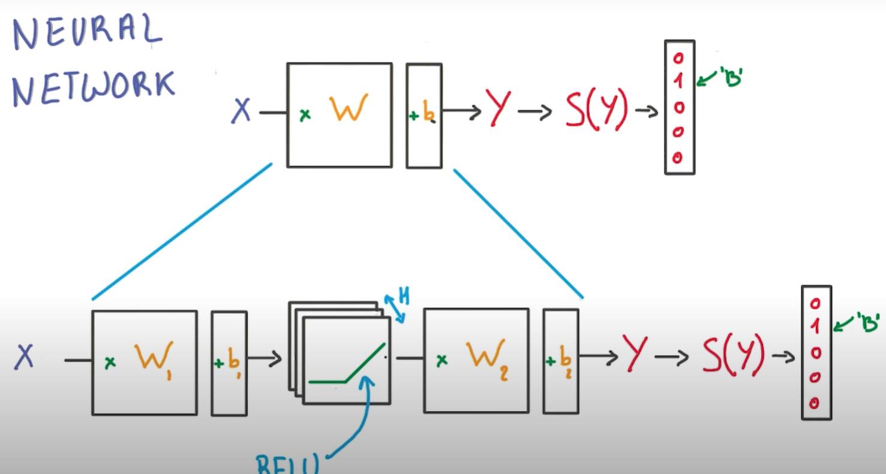

# Intro to Deep Neural Network

Because we are lazy engineer we get something that works, the `Logistic Classifier` and do the minimount amount of changes to make it non linear. Instead of having a single matrix multiply as a classifier, we are going to insert a `ReLU` right in the middle, we now have 2 matrixes, one going from the inputs to the ReLUs and another one conecting the ReLUs to the classifier.

We solve the problem of the linearity thanks by the RELU in the middle, but now have a new parameter to tune $H$, which correspond to the number of Relu's units that we have in a classifier.