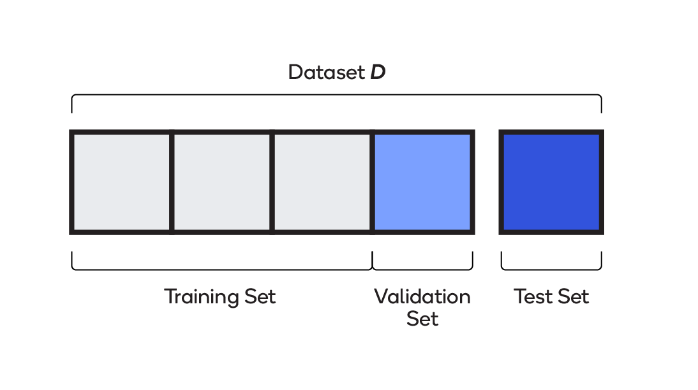
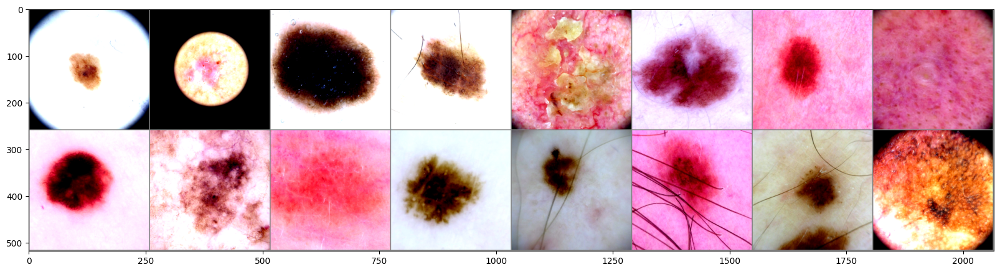
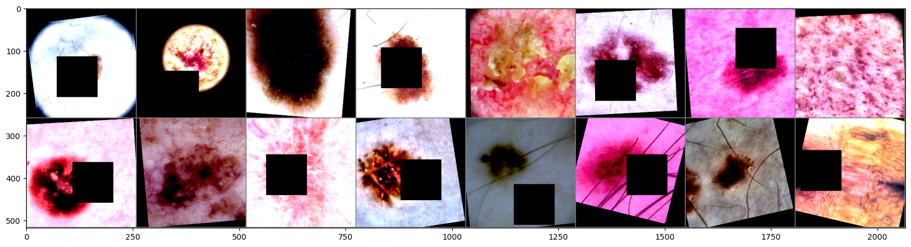
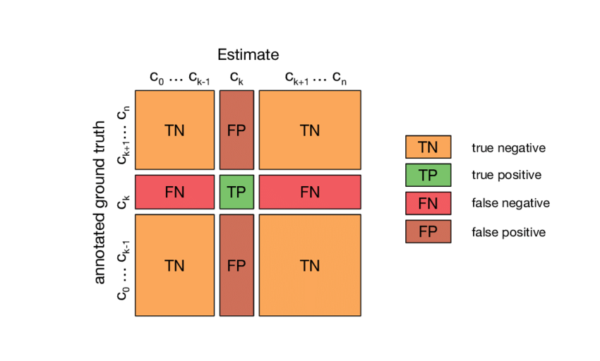
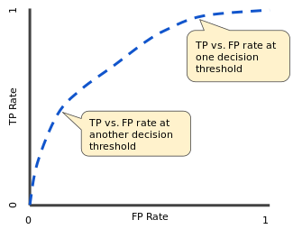

---
bibliography:
- biblio.bib
nocite: "[@TimelyMelanomaDetection]"
---

::: Large
:::

::: titlepage
\

::: center
[Master's thesis]{.smallcaps}\

::: spacing
2

------------------------------------------------------------------------

\
**A Platform for Classifying Melanoma**\

------------------------------------------------------------------------

\
:::

[Wilber Eduardo Bermeo Quito]{.smallcaps}\
September 2023\
Master in Data Science\
*Advisors:*\
[Dr. Rafael Garcia Campos]{.smallcaps}\
University of Girona\
Departament of Computer Architecture and Technology\
[Sr. Luis Pla Llopis]{.smallcaps}\
Accenture S.L.\
:::
:::

::: center
**Abstract**
:::

We present a platform for Melanoma Classification, leveraging a
technical infrastructure based on Convolution Neural Network (CNN)
models based on ResNet18.

For training and validation, exclusively we have utilized image data,
and no additional metadata is incorporated during the training process.
Various training strategies, such as data augmentation, learning rate
decay, dropout, etc., were employed to enhance models performance.

The resulting models are accessible through a API, enabling users to
interact with them via a straightforward web application. Users can
submit batches of images to the API for classification, contributing to
a user-friendly experience.

This platform demonstrates the efficacy of CNNs in melanoma
classification, highlighting the importance of diverse training
approaches. The API provides a practical interface for users to
seamlessly integrate melanoma classification into their workflows.

# Introduction

Skin cancer, including melanoma, is a significant global public health
concern. Melanoma presents a considerable challenge due to its high
mortality rate and the critical importance of early detection for
successful treatment. Cancer begins when healthy cells undergo changes
that cause them to grow and divide uncontrollably, forming tumors. These
tumors can be classified as either cancerous (malignant) or
non-cancerous (benign).\
In recent times, there has been a growing focus on automating tasks in
the medical field through Computer-Aided Diagnosis (CAD)[^1]. Some
studies have demonstrated that these systems can achieve results similar
to those of professionals. However, the integration of CAD into the
medical system remains a significant challenge.\
The development of a CAD system necessitates the creation of models
capable of effectively classifying melanoma. The SIIM-ISIC Melanoma
Classification challenge specifically tasks participants with building
models for identifying melanoma using skin lesion images and associated
metadata. This thesis outlines our approach, wherein we leverage data
from this challenge to train our models and subsequently expose them
through our platform. By doing so, we contribute to the ongoing efforts
to bridge the gap between cutting-edge medical imaging technology and
practical clinical applications.

# Objectives

The final objective of this thesis is to craft a CAD infrastructure,
focused on melanoma detection using deep learning vision models capable
of detecting melanoma on dermoscopy images. To this end, the gradual
achievements that must be accomplished are:

-   Gaining a comprehensive understanding of the theory behind deep
    learning vision models and its practical applications.

-   Select a base transfer model. Is the model good enough?, the
    selection of this model is given by the technical limitations?, or
    any other justification.

-   Study different approaches to train the models and select a good
    evaluate metric given the dataset distribution of dermoscopy images.

-   Develop the CAD infrastructure. It should contain the trained
    models, a simple web UI[^2], an API[^3] and finally a mechanism
    using Docker to create the images of these services making it ease
    to deploy in any based Linux System.

# Development process

The project methodology employed in this endeavor follows a continuous
process. The project incorporates the concept of utilizing idle time
effectively. For instance, during the training of models, there are
periods of idle time, which we exploited by concurrently working on
other tasks related to developing the entire infrastructure. This
approach allows for maximizing productivity throughout the project, see
Figure [1](#fig:flux_development){reference-type="ref"
reference="fig:flux_development"}.

::: landscape
{#fig:flux_development
width="82%"}
:::

# CAD infrastructure pipeline

Our CAD infrastructure pipeline (see Figure
[2](#fig:cad-pipeline){reference-type="ref"
reference="fig:cad-pipeline"}), consists of different steps, beginning
with data acquisition, followed by data preprocessing. We then set up
different datasets for training, validation, and testing. Subsequently,
we train the models and, assess the models gathering metrics and finally
we deploy the models under an API.

{#fig:cad-pipeline
width="90%"}

[]{#fig:cad-pipeline label="fig:cad-pipeline"}

# Data and training strategies

Inspired by the approach of the Winning Solution to the SIIM-ISIC
Melanoma Classification Challenge [@WinningISIC]. The Winning Solution
team observed that in the entire dataset of 2020, comprising 33K images,
only 1.76% were positive samples (i.e., malignant). In response, they
decided to augment this data by incorporating information from the
datasets of the same competition from the previous years (2018 and
2019). Although the individual datasets from these earlier years were
smaller, totaling 25K images, they exhibited a positive ratio of 17.85%.
This strategic combination allowed for a more balanced representation of
positive cases in the training data.\
To build the original dataset, we utilized 8 classes selected from the
raw dataset, as the remaining classes we considered not significant or
there were very few samples of them. Any sample that was not categorized
as one of the following classes were excluded from the training process.

-   melanoma

-   nevus

-   BCC (Basal Cell Carcinoma)

-   BKL (Benign lesions of the keratosis)

-   AK (Actinic Keratosis)

-   SCC (Squamous Cell Carcinoma)

-   VASC (Vascular Lesions)

-   DF (Dermatofibroma)

The filtered dataset comprises 31,265 distinct image samples,
demonstrating a highly imbalanced dataset, as evident from Figure
[3](#fig:hole-dataset-distribution){reference-type="ref"
reference="fig:hole-dataset-distribution"}.

{#fig:hole-dataset-distribution
width="75%"}

[]{#fig:hole-dataset-distribution label="fig:hole-dataset-distribution"}

We started dividing the original dataset into three subsets using the
Holdout set scheme, see Figure
[\[fig:holdout-test-scheme\]](#fig:holdout-test-scheme){reference-type="ref"
reference="fig:holdout-test-scheme"}.\
During the training phase, the test set remains completely separate and
is not used in any way to configure the hyper-parameters. This ensures
that the performance of a model on the test set is not artificially
inflated by adjusting hyper-parameters to achieve an exceptionally good
outcome in the validation set.\

The data from the ISIC Archive was divided using the following
percentages: 80% for training, 10% for validation, and 10% for testing.
Each subset contain the same distribution of classes as the original
dataset, i.e., we applied stratification.

::: adjustbox
width=0.7, trim=0cm 1cm 0cm 1.25cm, clip
{width="\\textwidth"}
:::

[]{#fig:holdout-test-scheme label="fig:holdout-test-scheme"}

In small to medium sized datasets, augmentation is important to prevent
overfit. For some of our trained models, we used in the training dataset
our augmentation pipelines, as illustrated in Figure
[\[fig:sample-of-datasets\]](#fig:sample-of-datasets){reference-type="ref"
reference="fig:sample-of-datasets"} and Figure
[\[fig:aug-sample-of-datasets\]](#fig:aug-sample-of-datasets){reference-type="ref"
reference="fig:aug-sample-of-datasets"}, with contains the following
augmentations from the popular and powerful PyTorch augmentation library
Albumentations [@Albumentations]: Transpose, Flip, Rotate,
RandomBrightness, RandomContrast, MotionBlur, MedianBlur, Gaus-
sianBlur, GaussNoise, OpticalDistortion, GridDistortion,
ElasticTransform, CLAHE, HueSaturationValue, ShiftScaleRotate, Cutout.

::: adjustbox
width=0.9
{width="\\textwidth"}
:::

[]{#fig:sample-of-datasets label="fig:sample-of-datasets"}

::: adjustbox
width=0.9
{width="\\textwidth"}
:::

[]{#fig:aug-sample-of-datasets label="fig:aug-sample-of-datasets"}

We decided to use as transfer model an already trained ResNet in the
ImageNet database. ResNet is short for \"Residual Network,\" is a deep
convolutional neural network (CNN) architecture that was introduced in
2015 by researchers from Microsoft Research [@ResNetPaper]. It
revolutionized the field of deep learning by addressing the challenge of
training very deep neural networks.\
There are various architectural variants or \"flavors\" of ResNet,
including ResNet-152, ResNet-101, ResNet-50, ResNet-34, and ResNet-18.
The number following the name of each ResNet variant indicates the
number of inner layers present in the architecture. The more the number
of the layers the more the accuracy, yet the number of parameters to be
trained increase. To accurately assess the performance of each ResNet
architecture, refer to Table [1](#table:resnet){reference-type="ref"
reference="table:resnet"}, which provides the accuracy achieved on the
ImageNet dataset along with the corresponding number of trainable
parameters in millions.

::: {#table:resnet}
  **Model**     **Accuracy**   **Parameters**
  ------------ -------------- ----------------
  ResNet-152       78.31%          60.2M
  ResNet-101       77.37%          44.5M
  ResNet-50        76.15%          25.6M
  ResNet-34        73.30%          21.8M
  ResNet-18        69.76%          11.7M

  : *Accuracy achieved on ImageNet and trainable parameters of each
  ResNet. Each image in the ImageNet dataset is associated with 1 of
  1,000 classes. Table by paperswithcode*
:::

[]{#table:resnet label="table:resnet"}

We decided to use ResNet18 as base model only for technical reasons and
time constrains. The lack of powerfull GPUs took us to pick this
estimator agains the others. There are other architectures that we could
have tried as: AlexNet, ResNetXt, VGG, etc, but comparing the
performance of those models in the SIIM-ISIC Melanoma competition is not
the goal of this thesis.

# Validation strategy

In any machine learning project, it is critical to establish a reliable
validation scheme to properly evaluate and compare models. This becomes
particularly crucial when dealing with a small to medium-sized dataset
or when the evaluation metric is unstable, as is the case with the
dataset provided in the competition. There are various metrics commonly
used to assess the quality of a model's predictions. We present a
selection of metrics that we find relevant for evaluating our models.\
A confusion matrix (see Figure
[\[fig:confusion-matrix\]](#fig:confusion-matrix){reference-type="ref"
reference="fig:confusion-matrix"}) is a square matrix with dimensions
`NxN`, where `N` represents the total number of classes being predicted.

::: adjustbox
trim=0pt 0.5cm 0pt 1cm, clip
{width="90%"}
:::

[]{#fig:confusion-matrix label="fig:confusion-matrix"}

From confusion matrix we can obtain other metrics such as:

-   **Accuracy**

    The Accuracy metric, calculates the ratio of correct predictions to
    the total number of predictions made on a dataset. It is not a good
    matric when working with unbalanced datasets.

    $$Accuracy = \frac{TP + TN}{TP + TN + FP + FN}$$

-   **True Positive Rate (TPR) or Sensitivity**

    The True Positive Rate tells about how many of the true class
    samples were correctly classified.

    $$TPR = \frac{TP}{TP + FN}$$

-   **False Positive Rate (FPR) or False Alarm Ratio**

    The False Positive Rate tells the proportion of the true class
    samples that were not correctly classified and are False Positive.

    $$FPR = \frac{FP}{FP + TN}$$

-   **Receiver Operator Characteristic (ROC)**

    An ROC curve plots TPR vs. FPR at different classification
    thresholds ` T`, where $T \ \text{for} \ 0 <= x <= 1$. Lowering the
    classification threshold classifies more items as positive, thus
    increasing both False Positives and True Positives. By plotting the
    curve, you can say which threshold is better, depeding on how many
    False Positive we are willing to accept.

    ::: adjustbox
    trim=0pt 0cm 0pt 0cm, clip
    {width="55%"}
    :::

    []{#fig:ROCCurve label="fig:ROCCurve"}

-   **Area Under the Curve (AUC)**

    The Area Under the Curve is a value between 0 and 1 that measures
    the ability of a classifier to distinguish between classes. It is
    used as a summary of the ROC curve. The higher the AUC, the better
    the performance of the model at distinguishing between the positive
    and negative classes.

    {#fig:auc-roc
    width="70%"}

    []{#fig:auc-roc label="fig:auc-roc"}

We used Test-time augmentation (TTA) in the inference phases, i.e.,
validation and testing. The idea behind TTA, is to generate multiple
augmented versions of the test input and average the predictions of the
model over these augmented samples to get a more robust and accurate
result.\
Let's denote the original test input as $X$ and the model's prediction
for $X$ as $Y$. TTA involves generating $N$ augmented versions per each
$X_i$, obtaining predictions for each of these augmented samples
($Y_i^1, Y_i^2,
..., Y_i^N$), and then averaging these predictions.

$$\text{TTA}(X_i) = \frac{1}{N} \sum_{j=1}^{N} f(j, Y_i^j)$$

Where:

-   $X$ is the original test input.

-   $Y$ is the model's prediction for the original input.

-   $X_i$ represents the $i$-th augmented version of the test input.

-   $Y_i$ is the model's prediction for the $i$-th augmented input.

-   $N$ is the number of augmented samples generated.

-   $f$ is defined as $f: Int \rightarrow X \rightarrow X$. The function
    applies simple transformations such as rotation and flips.

# Model metrics

The training phase ended with the development of eight models. Various
learning policies such as; Learning Decay with schedulers and
regularization with Data Agumentation and Dropout were applied. We
computed other metrics such as, recall and presition but in Table
[3](#table:resume-metrics){reference-type="ref"
reference="table:resume-metrics"} we show the AUC metric of in all
datasets for the all models.\
The metrics with a gray background in Table
[3](#table:resume-metrics){reference-type="ref"
reference="table:resume-metrics"} are from models that incorporated
additional regularization techniques. These models were trained for 40
epochs since regularization tends to slow down the minimization of the
objective function compared to the other models that were trained for
only 20 epochs.\

Models that used a scheduler during the training stage are denoted with
a symbol next to their names. For reference, the mapping between the
scheduler used and the corresponding symbol is provided in Table
[2](#table:scheduler-mapping){reference-type="ref"
reference="table:scheduler-mapping"}.

::: {#table:scheduler-mapping}
   **Scheduler Mapping**  
  ----------------------- --------------------------------
          $\star$                Step Learning Rate
          $\ast$           Cosine Annealing Learning Rate
         $\bullet$         Cosine Annealing Warm Restarts

  : *Scheduler mapping.*
:::

::: {#table:resume-metrics}
                   **Train AUC**   **Val AUC**   **Test AUC**
  -------------- --------------- ------------- --------------
  M0                       0.952         0.903          0.892
  M1 $\star$               0.947         0.900          0.892
  M2 $\ast$                0.933         0.895          0.885
  M3 $\bullet$             0.935         0.896          0.886
  M4                       0.886         0.877          0.858
  M5 $\star$               0.867         0.861          0.843
  M6 $\ast$                0.874         0.868          0.848
  M7 $\bullet$             0.877         0.869          0.849
  Mean                   94.175%       89.850%        88.875%
  SD                      0.921%        0.370%         0.377%
  Mean                   87.600%       86.875%        84.950%
  SD                      0.787%        0.655%         0.625%

  : *AUC metric in all datasets.*
:::

[]{#table:resume-metrics label="table:resume-metrics"}

As a result, we conclude that the first group of models performed well
on the test set with an average AUC of 88.875% and a small standard
deviation of ±0.377%. However, they showed signs of overfitting in the
training process, as model performed excelent in the training data but
poorer in the validation set. In contrast, the second group of models
that were trained with additional regularization techniques, achieved
lower results in the test set, but did not suffer from overfitting. They
had an average AUC of 84.950% with a standard deviation of ±0.625%.

# CAD infrastructure result

During model training, we also developed the necessary CAD
infrastructure. For the API, we used a flexible approach with soft
configurations that could be specified through file-based parameters,
offering adaptability and simplified management. Additionally, we
created an intuitive UI for seamless interaction between healthcare
professionals and the models.

We also provided a Docker-based script for easy deployment of the
infrastructure on any Linux operating system, ensuring efficient startup
and operation.

[^1]: CAD refers to the use of computer algorithms and technologies to
    assist healthcare professionals in the process of medical diagnosis.

[^2]: User Interface. Is the point of human-computer interaction and
    communication in a device.

[^3]: Application Programming Interface. Is a set of protocols,
    routines, tools, and definitions that allow different software
    applications to communicate with each othe
