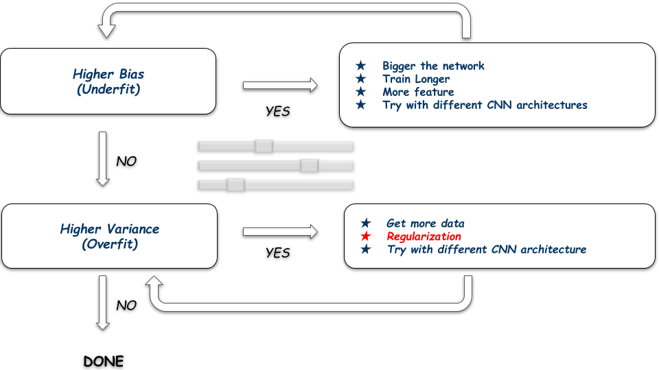
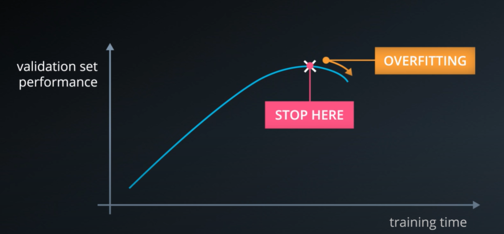
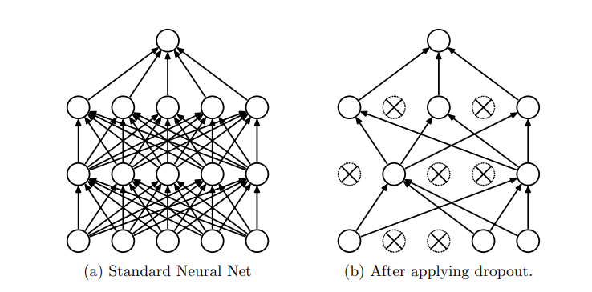
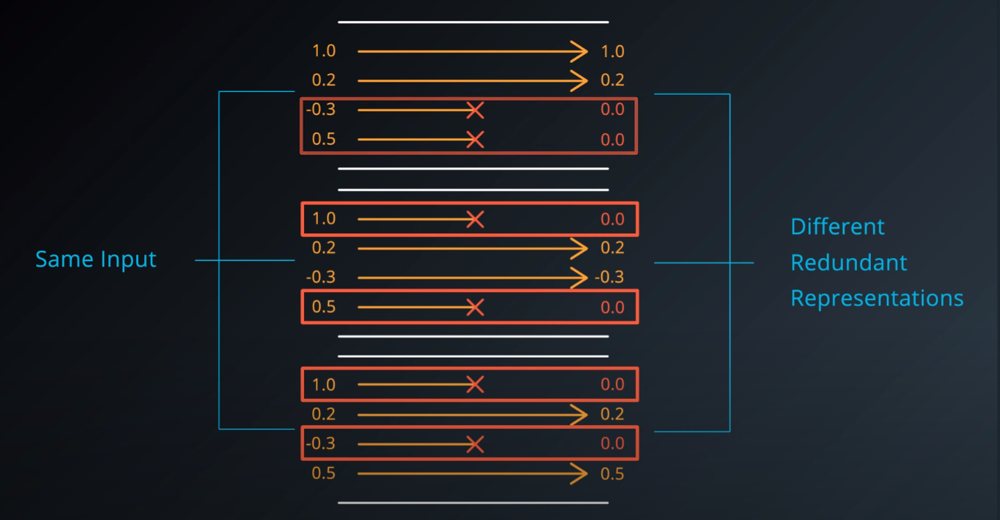
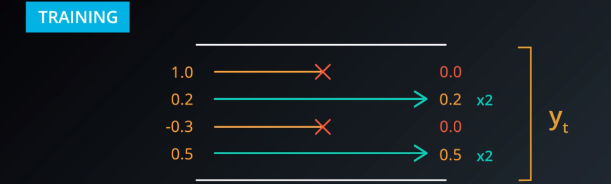
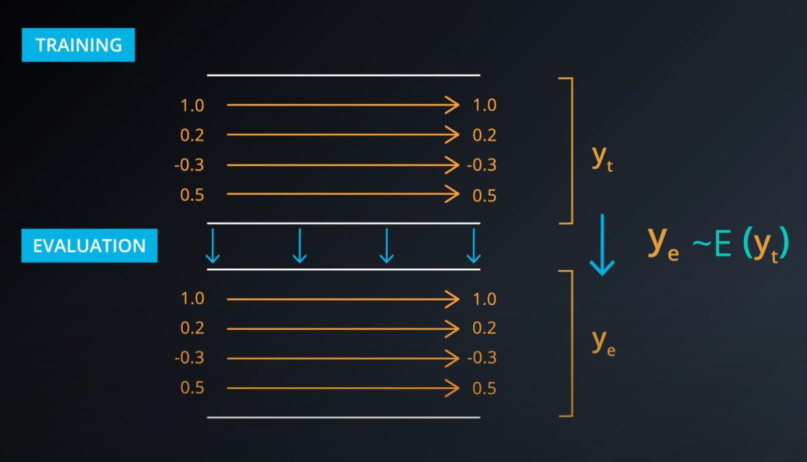

# Regularization techniques[^1]

Why did we not figure out earlier that deep models are effective? There are many reasons, one reason is that deep models only really shine if you have enough data to train them. An other reason is now we now know better today how to train very big models using better regularization techniques.

A deep network that's just the right size for your data is very, very hard to optimize. In practice, we always try networks that are way to big for our data and then we try our best to prevent them from over-fitting.

## Early termination[^2]

The first way we prevent over fitting is by looking at the performance in the validation set and stopping in train as soon as we stop improving. This is the best way to prevent the network from over optimizing in training set.

## What is Regularization in ML?

Regularization is an approach to address over-fitting in ML. Over-fitted model fails to generalize estimations on test data, regularization reduces the variance of the model.

Regularizing means applying artificial constrains on the network that implicitly reduce the number of free parameters. While not making it more difficult to optimize, also, an effective regularizer is one that makes a profitable-trade, reducing variance significantly while not overly increasing the bias.

## How to introduce regularization in deep learning

The simplest way of introducing regularization is modifying the loss function. The most common family of approaches used are parameters norm penalties. Here for example, we add a parameter norm penalty of the form $\Omega(\theta)$ to the loss function $J(\theta;X,y)$.

$$ J'(\theta;X,y) = J(\theta;X,y) + \alpha\Omega(\theta) $$

Where $\alpha$ is a hyperparameter which values are $alpha >= 0$ and rules the weights from the contribution of function penalty, hence the effect of the regularization.

## L2 Regularization

Also known as weight decay or ridge regression, adds a norm penalty in the form of $\Omega(\theta) = ||w||^{2}_{2}$. Where $||w||^2_2$ is the sum of the squares of all the attribute weights, for example $||w||^2_2 = w_1^2 + w_2^2 + ... + w_n^2$.

The loss function has been transformed to:

$$ J'(w;X,y) = J(w;X,y) + \alpha||w||^{2}_{2} $$

An equivalent expression is the following:

$$ J'(w;X,y) = J(w;X,y) + \alpha\sum_{j}w_{j}^{2} $$

The L2 regularizer will have a big impact on the directions of the weight vector that don’t “contribute” much to the loss function. On the other hand, it will have a relatively small effect on the directions that contribute to the loss function. As a result, we reduce the variance of our model, which makes it easier to generalize on unseen data.

## L1 Regularization

Also known as Lasso, prevents the weights from getting too large (defined by L1 norm). Larger the weights, more complex the model is, more chances of over-fitting. L1 regularization introduces sparsity in the weights. It forces more weights to be zero than reducing the the average magnitude of all weights.

Lasso norm penalty is expressed as:

$$ \Omega(\theta) = ||w||_{1} \hspace{1em} or \hspace{1em} \Omega(\theta) = \sum_{i}|w_{i}| $$

Hence the loss function is expressed as:

$$ J'(w;X,y) = J(w;X,y) + \alpha||w||_{1} $$

An equivalent expression is the following:

$$ J'(w;X,y) = J(w;X,y) + \alpha\sum_{i}|w_{i}| $$

## Elastic net Regularization

It's a mix between L1 and L2...

## Dropout[^3]

Deep neural networks contain multiple non-linear hidden layers and this makes them very expressive models that can learn very complicated relationships between their inputs and outputs. With limited training data, however, many of these complicated relationships will be the result of sampling noise, so they will exist in the training set but not in real test data even if it is drawn from the same distribution. This leads to over-fitting and many methods have been developed for reducing it. These include stopping the training as soon as performance on a validation set starts to get worse, introducing weight penalties of various kinds such as L1 and L2 regularization and others.

With unlimited computation, the best way to “regularize” a fixed-sized model is to average the predictions of all possible settings of the parameters, with large neural networks, however, the obvious idea of averaging the outputs of many separately trained nets is prohibitively expensive.

The term “dropout” refers to dropping out units (hidden and visible) in a neural network. By dropping a unit out, we mean temporarily removing it from the network, along with all its incoming and outgoing connections, as shown in figure bellow. The choice of which units to drop is random. In the simplest case, each unit is retained with a fixed probability $p$ independent of other units, where $p$ can be chosen using a validation set or can simply be set at 0.5, which seems to be close to optimal for a wide range of networks and tasks.

The network can never relief in any given activation to be present, because they may be squashed at any given moment. So it's force to learn a redundant representation for everything to make sure that at least some of the information remains. Forcing the net learning redundant representation seems very inefficient, but at the end makes things more robust and prevents over-fitting.

When you evaluate the network that's been trained with drop out, you obviously no longer want this randomness. You want something deterministic. Instead, we are going to take a consensus over this randomness. The consensus opinion is averaging the activations, where $Y_{e} \approx \Epsilon(y_{t})$ and $y_{t}$ are all the activations got during training. The trick used by this expectation holds is that during training, not only use zeros to represents the activations that are dropped out, but you also scale the remaining activations by a factor of 2.

This way, when it comes time to average them during evaluation, we just remove the dropouts and scaling operations from the neural network, and the result, is an average of this activation that is properly scaled.

[^1]: [Regularization techniques for training deep neural networks](https://theaisummer.com/regularization/).

[^2]: [Early Termination](https://classroom.udacity.com/courses/ud730/lessons/14e8621e-bc7f-4df6-a05a-df6a695c9791/concepts/ca710a33-f75e-4847-878f-1db635dad608)

[^3]: [Dropout: A Simple Way to Prevent Neural Networks from Over-fitting](https://jmlr.org/papers/volume15/srivastava14a/srivastava14a.pdf)
