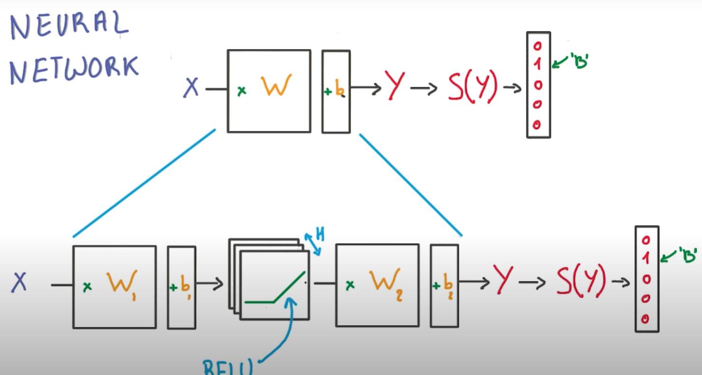
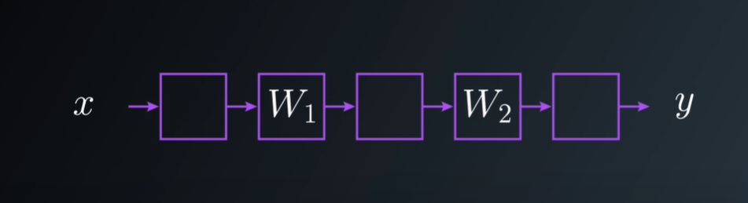
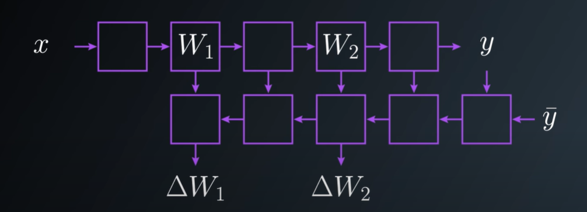
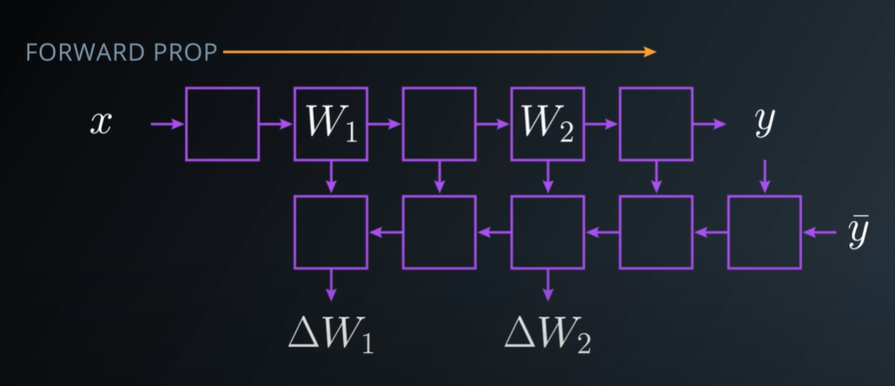
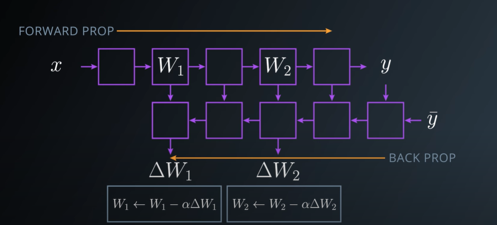
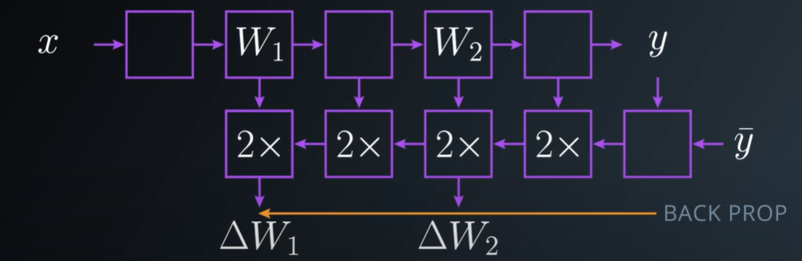
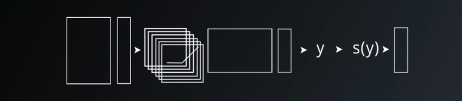
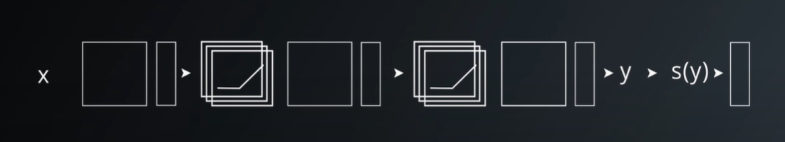
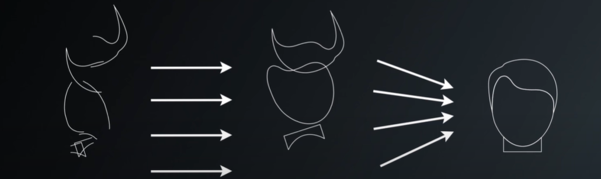

# Intro to Deep Neural Network

A Neural Network is a supervised algorithm, where we have input data(independent variables) and output labels(dependent variable). By using the training data we will train NN to predict the output variable. In the beginning, NN makes some predictions which are almost random. These predictions are compared with the actual output and the error is computed as the difference between predicted and actual output. Our objective is to train the NN to reduce this error/cost function.

For every single little batch of the data in the training set we run the [Forward Propagation](#forward-propagation) and then the [Back Propagation](#back-propagation) that will give us gradients for each of the weights in our model, then we apply those gradients with a learning rate to the original weights and update them. We are going to repeat these proces many many times (epocs) and this is how the entire model gets optimized.

## Logistic Classifier to Deep Neural Network

Because we are lazy engineer we get something that works, the `Logistic Classifier` and do the minimount amount of changes to make it non linear. Instead of having a single matrix multiply as a classifier, we are going to insert a `ReLU` right in the middle, we now have 2 matrixes, one going from the inputs to the ReLUs and another one conecting the ReLUs to the classifier.

We solve the problem of the linearity thanks by the ReLU in the middle, but now have a new parameter to tune $H$, which correspond to the number of ReLU's units that we have in a classifier.

## Neural Network phases

There are two main phases in the optimization of NN model. This fases are known as chain because they are the application of multiple function one followed by the other.

Here is an example, imagine your network is a stack of simple operations like linear transforms, ReLUs... some have parameters like the matrix transform, others dont like ReLUs. When you apply the data for some input $x$ you have data flowing trought the stack up to your prediction $y$.

With this arquitecture, we can build the derivative of each layer and produce their gradients. This graph can be derived completely automatically from the individual operations in the network.

### Forward Propagation

During the feed forward step of NN, predictions are made using input node values, weights and bias. The similar type of computation will occur at each node and the computation will propagate forward till the last node

### Back Propagation

Once we finish the forward propagation, we get prediction at the output layer. With this output and the actual label we can compute cost function / error `MSE`.

Our objective is to fine tune the network parameters to minimize the error term(cost function), in such a way that the predictions get nearer to actual labels. If you look at our neural network, you'll notice that we can only control the weights and the bias. In order to minimize the cost, we need to find the weight and bias values for which the cost function returns the smallest value possible. The smaller the cost, the more accurate our predictions are. This is an optimization problem where we have to find minimum of the optimize function. To optimize the process `Stochastic Gradient Descent` is used.

In particular, each block of the back prop often takes about twice the memory for the forward prop and twice to compute, that's important when you want to size the model and fit into your memory.

## Training a Deep Learning Network

For now we have a small neural network, it's not particularly deep, just a few layers. We can make it more complex, by increasing the size of the hidden layers in the middle, but it turns out that increasing this $H$ is not particularly efficient in general.

Instead, what we can do is add a lot of more layers. There are a lot of good reason for do that.

One is parameter efficiency. You can typically get more performance going deeper than wider. Another one is that a lot of natural phenomena, that we may are interested in, tend to have a hierarchical structure which deep model naturally capture.

For example, in the case of images, if we visualize what the model learns, you'll often find very simple things at the lowest layers, like lines or edges. Once you move up, you tend to see more complicated things like geometrics shapes, go further up and you start seeing things like objects. This is very powerful, because the model structure matches the kind of abstractions that you might expect to see in the data and as a result the model has an easier time learning them.

