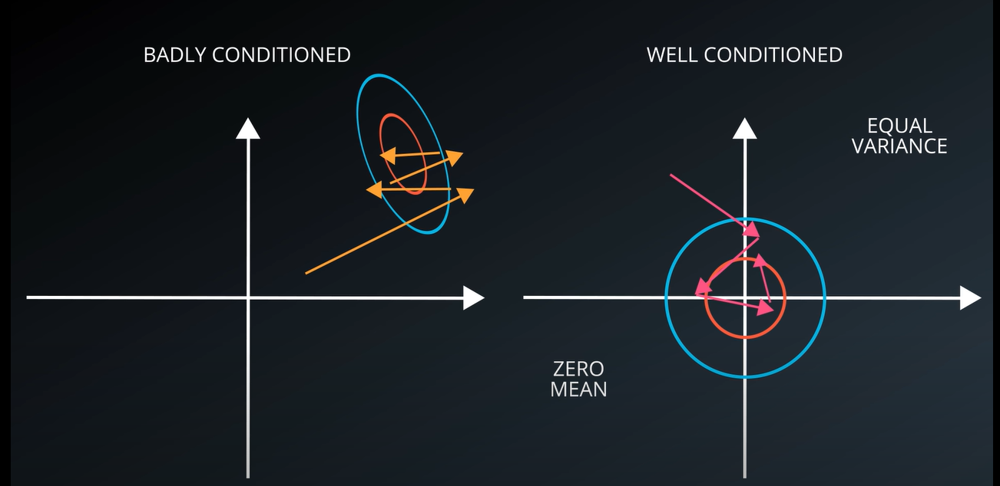

# Normalized Inputs and Initial Weights

## Numerical stability issues

You expect to have the result of 1.0 yet the machine throws 0.95367...

We want the values involved in the calculation to the lost function that we care about to never get to big or two small, because it may cause problem for the optimization function (gradient descendent).

```
a = 10**9
for i in range(a):
    a = a + 1e-6
print(a)
```

## Badly conditioned vs well conditioned problem 

On top of the numerical issues, there are also really good mathematical benefits to keep mean of 0 and equal variance when ever posible.

- *MEAN*

$$ \mu(X_{i}) = 0 $$

- *VARIANCE*

$$ \sigma(X_{i}) = \sigma(X_{j}) $$

A badly condition problem means that the optimizer has to do a lot of searching to have a good solution. A well condition problem makes it more eassy to the optimizer to find a good solution.



### Images

When we deal with images we tipically deal with values between [0..255], we pick the pixel values of the images and apply:

$$ \frac{R - 128}{128} \hspace{5em} \frac{G - 128}{128} \hspace{5em} \frac{B - 128}{128}  $$

## Weight and biass initialization

We always want that our weights and biasses always be initzialized a good enought starting point for the gradiant descendent algorithm to preceed.

$$ W_{0}? \hspace{5em} b_{0}? $$

There are a lot of fancy schemes to find good initialization values. The simplest general method is to drop the weights randomly for a Gauss distribution of mean 0 and a standard deviation of $\sigma$.


