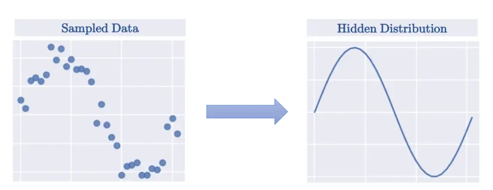
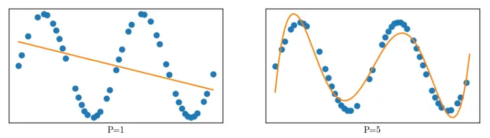
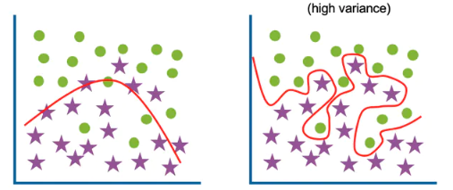
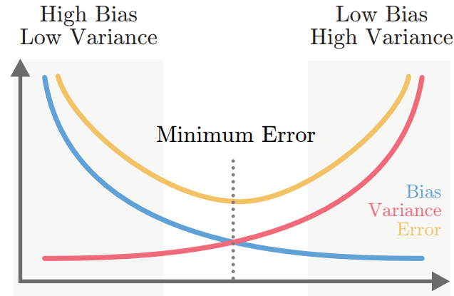

# Overfitting vs Underfitting

First, let's clarify that bias-variance tradeoff and overfitting-underfitting are equivalent.

## Where does it steam for?

The overall idea behind the ML system is to model the hidden distribution of a data set from the samples collected. If you sample enough from the distribution, you can get a fairly accurate re-creation of the distribution as shown below.

## What is Bias and Variance in ML

Both bias and variance can be addressed as the source of errors in our ML system. Suppose that we have a training dataset $D$ consisting of $(x,y)$ pairs sampled from the hidden distribution $(y=f(x)+e)$. We build a model $f'$ from the dataset $D$ such that the error between the training labels and the predicted value is minimized $error = y-f'(x)$.

### Bias

Bias is termed as the error between the average model prediction $f'(x)$ and the ground truth $f(x)$.

$$ bias = \Epsilon[f'(x)] - f(x) $$

The bias of the estimated function tells us the capacity of the underlying model to predict the values. Simpler models, in general, fail to capture the complexity of high dimensional data, and hence they have a higher bias.

The high bias of a model is associated with the following

- Under-fitting — Fails to capture the data trends
- Stresses more on generalization
- High error on both the training and test dataset
- An overly simplified model

### Variance

Variance refers to the average variability in the model prediction for the given dataset.

$$ variance = \Epsilon[(f'(x) - \Epsilon[f'(x)]^2)] $$

The variance of the estimated function tells you how much the function is capable of adjusting to the change in the dataset. The greater the variance the more robust the function is to the changing dataset.

The high variance of a model is associated with the following:

- Over-fitting — Ends up modeling the noise in the data set
- Stresses more on fitting each data point as close as possible
- Low error on training data, but a high error on test data
- An overly complex model and sparse training data.

## Bias and Variance Trade-off

In general, if you increase the complexity of the underlying system, the bias of the system decreases while the variance increases. They both are inversely proportional to each other. You can’t decrease both of them. This point will be the basis for the bias-variance tradeoff.

The error is defined as $Error = bias^2 + variance + irreducible\ error$, the best model is where the error is reduced.

