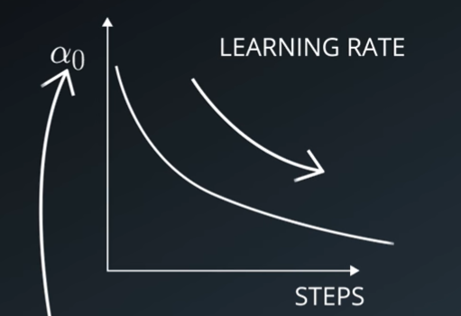
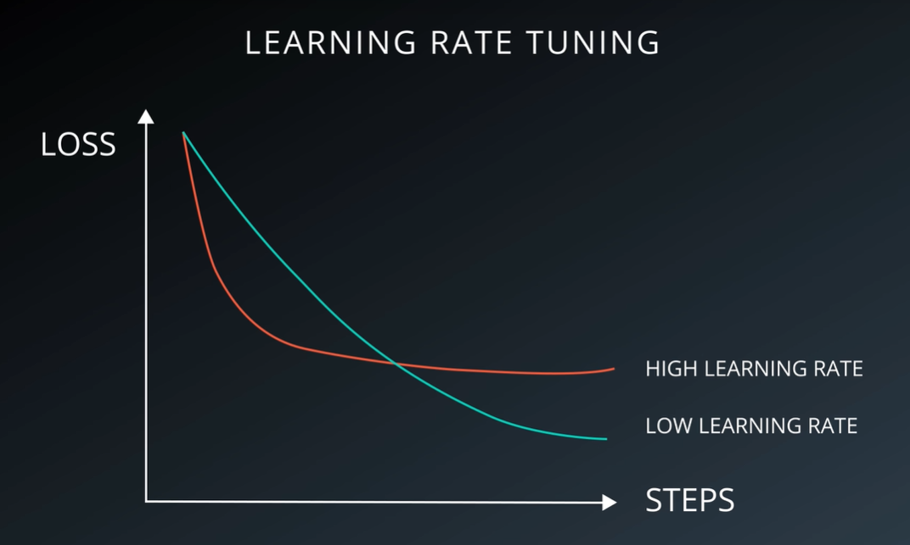

# Learning Rate

The stochastic gradient descent technique is used to develop deep learning neural networks.

Stochastic gradient descent is an optimization process that uses instances from the training data to evaluate the error for the current state, then updates the weights of the model using the back-propagation of errors procedure, sometimes known as simply backpropagation.

The step size, often known as the **learning rate**, is the amount by which the weights are changed during training.

The learning rate is an adjustable hyperparameter that has a modest positive value, usually between 0.0 and 1.0, and is used in the training of neural networks.

The weights of each node in the network are in charge. Instead of updating the weight with the whole amount, the learning rate is used to scale it.

This implies that a learning rate of 0.1, which is a popular default setting, means that each time the weights in the network are updated, they are modified by 0.1 * or 10% of the projected weight error.

## Learning Rate Decay

One thing that is always the case however is that is beneficial to make that step smaller and smaller as you train. Some like to apply and exponencial but there are a lot of ways to handle it. Lowering it over time is the key thing to remember.

## Learning Rate Tuning

The pace of speed at which the model learns is controlled by the hyperparameter. It regulates the amount of allocated error.

In a certain amount of training epochs, given a well-designed learning rate, the model will learn to best approximate the function given available resources.

A high learning rate helps the model to learn more quickly, but at the cost of a sub-optimal final set of weights. A slower learning rate may allow the model to acquire a more optimum or even globally optimal set of weights, but training will take much longer.

A learning rate that is too high will provide weight updates that are excessively big, and the model’s performance will swing throughout training epochs. Weights that diverge are thought to be the reason for oscillating performance. A slow learning rate may never converge or become trapped on an inferior solution.

In the worst-case scenario, too-large weight changes may cause the weights to explode!
As a result, we should avoid using a learning rate that is either too high or too low. Nonetheless, we must build up the model so that a “good enough” collection of the mapping issue is described by the training dataset.

Never trust how quickly you learn, it has often little to do in how well you train.

