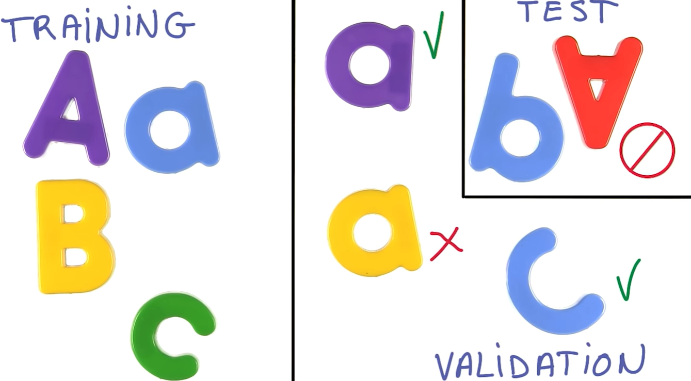

# Mesuring Performance

One good thing to know is that once you know how to mesure the performance on a problem, you've already solved half of it.

Imagine I have a bank of images labeled and I tried to mesure the model with the training set $X_{train}$, now what happens when you use the classifier in new images, images that the classifier has never seen before and you mesure how many you get right. The classifier does not good as well has it did with the training set. By the mesure we define earlier, the classifier may be a good classifier, It would get 100% accuracy on the training sets but as soon as it sees new images, it's loss, this is not a great classifier.

The problem is that the classifier has memorized the training set and it fails to generalize to new examples. Every classifier that it's built, try to memory the training sets. And they usually do that very very well. The job here is to help the classifier to generalize to new data instead.

The simplest way is to take a small subset of the traning set, not using in training process $X_{val}$. We mesure the error in this validation data. Now the classifier can not cheat because it has never seen this data so it can't not memorize it. But there is still a problem because training a classifier is usually a process of trial and error. You try a classifier and mesure it's performance and then you try another one and you mesure again, and another and another. You tweak the model, you mesure... and finally you find what you think is a great classifier. Now you deploy your system in a real production environment and you get more data and you score the performance in this new data, and it doesn't do as good as well. What can possible had happend? what happened is that the classifier has seen the data inderectly becase of **you**, every time you do a descition; which classifier to use, which parameters to use, you actually give information to you classifier about the validation data.

A solution to this problem is to take another chunk from the training set and hide it $X_{test}$. Now you can create a model based on trial and error because the final test will be done by a set of data never seen before. 

## Validation Test

The bigger the test set the less noisy the accurasity mesure will be. There is a *rule of thumb*, a change that affects at least 30 examples in the validation set one way or another, is usally statistically significant and tipically can be trusted.

### Rule of *30*

Imagine that the validation set has 3000 examples and following the rule of *30* which level of accuracy improvement can be trust and not being caused by noice?

|YES|NO|Acuracy|
|---|---|---|
| X |   | $80\% \rightarrow 81\%$|
|   | X  | $80\% \rightarrow 80.5\%$|
|   | X  | $80\% \rightarrow 80.1\%$|

$$ \frac{1.0*3000}{100} >= 30 $$

$$ \frac{0.5*3000}{100} < 30 $$

$$ \frac{0.1*3000}{100} < 30 $$