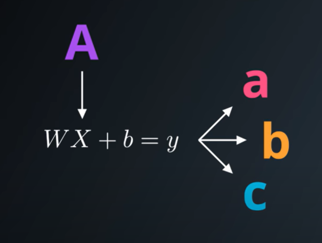

# Logistic Classifier

A logistic classifier is what is call the linear classifier.

$$ WX + b = y $$

It takes the input, for example the pixels of an image and applies a liner function to it to generates the prediction.

## Linear Regression

A linear function is just a big matrix multiply. It takes all the inputs as a big vector that we denote $X$ and multiplies them to a weights matrix $W$, then we add the bias $b$. With this computation we get the scores $y$.

The weights and the bias is where the machine learning comes in. At training the model we want to find the values of $W$ and $b$ which are good at performing those predictions.

## SOFTMAX

To do the classification, we know that each sample can only have one posible label, so we are going to transform the scores given by the linear regresion into probabilities.

| y | p |
|---|---|
|2.0|0.7|
|1.0|0.2|
|0.1|0.1|

We want the probabilities of the correct class be close to 1 and the probability for every other class be close to 0.

The way to transform the scores into probabilities is using the SOFMAX function.

$$ S(y_{i}) = \frac{e^{y_{i}}}{\sum_{j}e^{y_{j}}} $$

The proper probabilities sum to 1 and they will be large when the scores are large and small when the scores are small.
