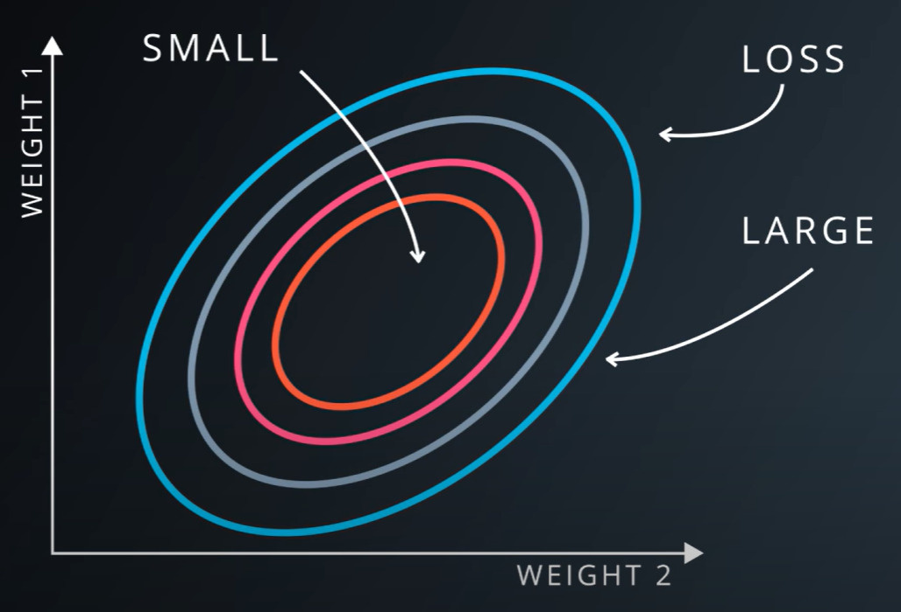
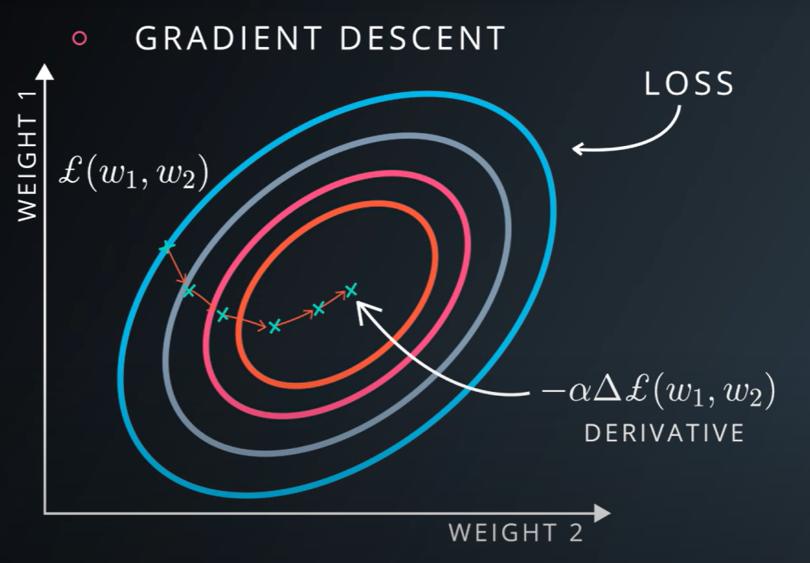
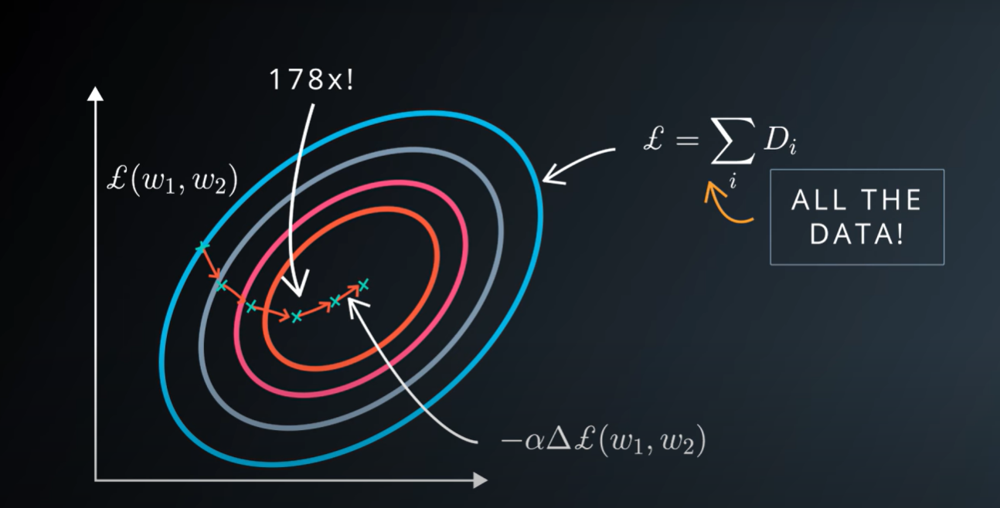

# Cross Entropy

`One-Hot Encoding` workds very well for most problems until you get situation when you have millions of classes, in that case, your vector becomes very large with a lot of zeros every where.

Using embedings, we can mesure how well we are doing by comparing the distance $D$ between 2 vectors. One that comes up from the classifier (Logistic Classifier) that contains the probabilities of our clases and the One-Hot encoded vector that correspons to the labels.

|S(Y)|L|
|---|---|
|0.7|1|
|0.2|0|
|0.1|0|

$$ D(S,L) = -\sum_{j}L_{i}*log(S_{i}) $$

The `Cross Entropy` is not symetric, because of the nasted $log$ in the equation. There will be 0 in $L$ vector where in the $S(Y)$ vector is guaranted that you always have a litle bit of probability every where, so you will never take a $log(0)$

$$ D(S,L) \neq D(L,S) $$ 

## Minimizing Cross Entropy

We need to find those weights $W$ and those biasses $b$ that minimizes the distance $D$ for correct class $L$ and get large distances for incorrect class $L$. 

$$ D(S(Wx + b),L) = D(S(Y), L) $$ 
$$ S(Wx + b) = S(Y) $$ 
$$ Wx + b = Y $$ 

One thing I can do is to mesure the distance $D$ averaged for the entere training set, for all the inputs and for all the labels that I have available. That is call the trainning `Loss`. `Loss` is the average of `Cross Entropy` of the entire dataset. Is an enourmous function because every example of the entire set has to be multiplied by the $W$ big weight matrix and all get ended in one big sum. We want that **all the distance to be small**, that would mean that we are doing a good job classifying the data and consequently **we also want the `Loss` function to be small**.

$$ \delta = \frac{1}{N}\sum_{i}D(S(Wx_{i} + b), L_{i})$$

### Gradient Descent

For example, imagine a function where the weight $W$ matrix is composed by two weight vectors. The function will be large in some areas and small in others. We want to find the weights that make the `Loss` be the smallest.

We just turned the machine learning problem into a numerical optimization problem. There is a lot of ways to solve a numerical optimization problem, the simples way is `Gradient Descent`.

`Gradient Descent` takes the derivative of the `Loss` with respect of the parameters and follow that derivative by taking a step backwards and repeat until it get's to the bottom. The bottom may be a local minimum.

The base `gradient descent` optimazer is not efficient, here is why; if computing the `Loss` takes n operations, computing the gradient takes 3x that compute. As we see earlier, the loss function is huge, it dependes on every single element of the training set and it can be a lot of compute for the `gradient descent` algorithm, if the training set is big and we want to train with a lot of data because in practice, the more data you get the more gains you get we have a problem in the time per calculation. And because `gradient descent` is iterative, you have to do that for many steps. See [Stochastic Gradient Descent](../stachastic-gradient-descent.md) for a fast estimator.

