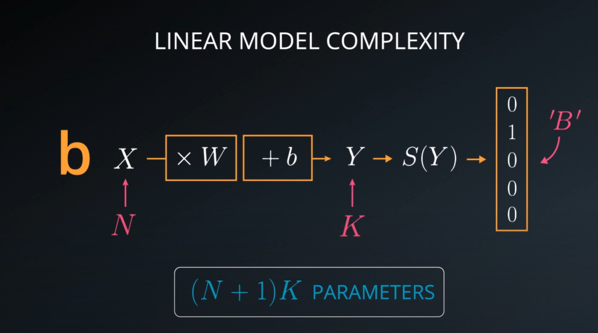

# Multinomial Logistic Classification

In statistics, multinomial logistic regression is a classification method that generalizes logistic regression to multiclass problems, i.e. with more than two possible discrete outcomes. That is, it is a model that is used to predict the probabilities of the different possible outcomes of a categorically distributed dependent variable, given a set of independent variables (which may be real-valued, binary-valued, categorical-valued, etc.).

Multinomial logistic regression is known by a variety of other names, including polytomous LR, multiclass LR, softmax regression, multinomial logit (mlogit), the maximum entropy (MaxEnt) classifier, and the conditional maximum entropy model.

$$ D(S(Wx + b), L) $$

## Linear model complexity

Linear models are nice but are also really limited. How many train parameters this model actually has? The input $X$ is the sample $b_{28\times28}$ and the output was 10 classes $A..J$.

The matrix $W$ takes an input the intire image which is $28\times28$, the output is of size 10, so the the other dimention of the matrix is 10. The biases $b$ is 10, so the total number of parameters to train is actualy $28\times28\times10 + 10$. The case in general, if you have $N$ inputs and $K$ outputs, you have in general $(N+1) \times K$ parameters.

## Linear model are simple but efficient

Multinomial logistic classification run over a linear model, which means that the capable of interactions that you can represent with this kind of models is somewhat limited. In the other hand, big matrix multiply are exactly why GPU where design for. They are relatively cheap, and very very fast. Numerically, linear operations are very estable, small changes in the input never yield big changes in the output. Derivative are really nice too, the derivative of a linear function is constant you can't get more estable numerically than a constant.

## Linear model are here to stay

We want to keep the parameters inside a linear function, but we also want to the entire model to be not linear. We can not just multipling our inputs with a linear functions, because it is just the equivalent for a one big linear function.

So, what we are going to do is introduce non linearity, see [Logistic Classifier to Deep Network](../DeepNeuralNetwork/LogisticClassifierToDeepNetwork.md).

