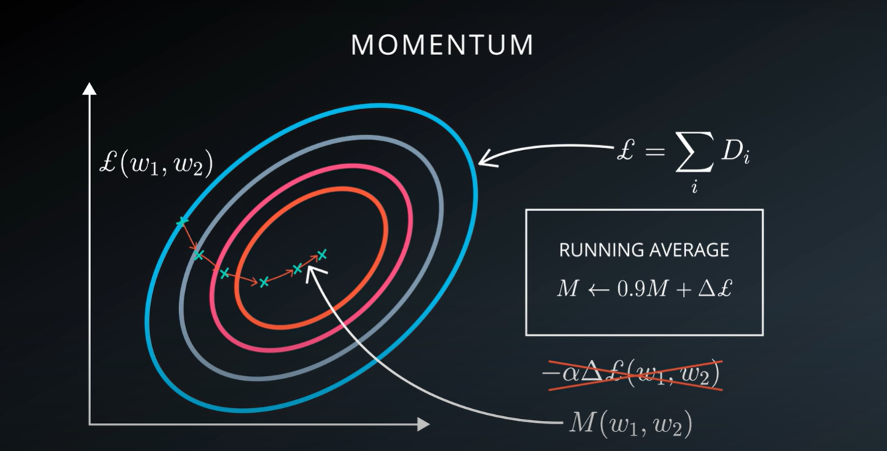

# Stochastic Gradient Descent

`Gradient Descent` is not efficient for optimize a function that depends on big data. `Stochastic Gradient Descent` bases on gradient descent but cheating, instead of computing the loss we are going to compute an estimation of the loss, a terrible estimate, but we will make less terrible increasing the iterations.

The estimator we are gonna use is simple computing the average loss of a very random fraction of the training data, training between 1 and a 100000 samples each time. The randomness is really important, because if is not random enought the method won't work.

So what we are gonna do is:

- Take randomly a very few samples from the training data
- Compute the loss for that sample
- Compute the derivative for that sample
- Finally, pretend that the derivative is the correct direction for the gradient descent

Of course in each iteration, derivative direction of the loss function may not be correct, in fact may increase the real loss at times, but we are going to componsate by doing this many many times. Each step is cheaper to compute, but of course we pay a price, we have to take many more steps. On balance, this method is more efficient than doing gradient descent.

This method is the core of `Deep Learning` because it works efficient and great with both, big data and model size.

## Momentum

With stochast gradient descent we are taking many steps in a random direction, but on agregate those steps take us towards the minimum of the loss function. Meanwhile the process is running what we can do is to compute the average of the gradient and use this average gradient to use the direction of current batch of the data. This leads to a better convergence.

